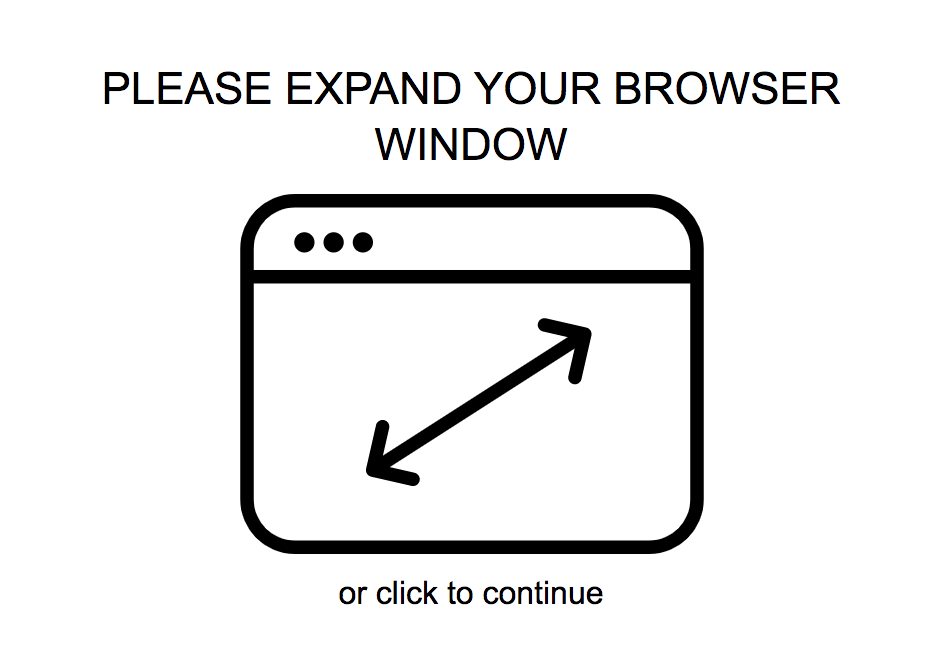
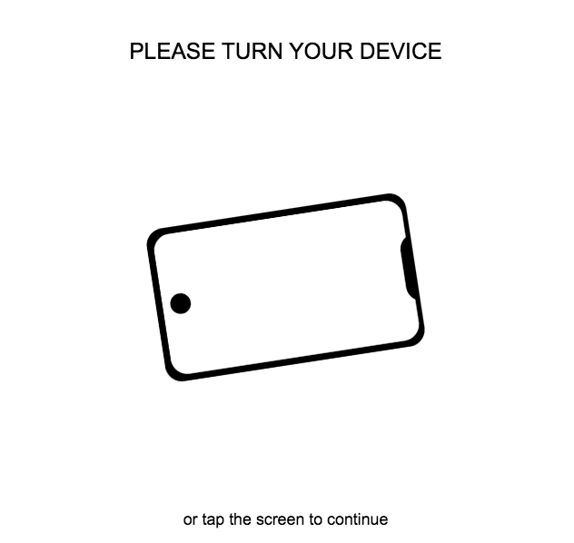

## About rotate-device

Plugin rotateDevice has been made to ask the users to rotate device/expand browser window to enjoy your site/app fully.
It has two types of notifications with build in markup and styles (or you can create your own mark up and styling):

- Desktop Notification


- Touch Device Notification



## Getting started with rotate-device

<strong>1. Download and install rotate-device</strong>

First of all we need to download required rotate-device files:
 - We can download them from <a href="https://github.com/ihavebadfantasy/rotateDevice.github.io">rotate-device repository</a> The files you need to use located at prod folder. You need both js and css files. Feel free to choose if you want to include min.js or .js version to your website/app.

 - Or we can install them via NPM, enter in terminal:

 ```bash
$ npm install rotate-device
```


<strong>2. Include rotate-device Files To Website/App</strong>

 ```html
<!DOCTYPE html>
<html lang="en">
<head>
    ...
    <link rel="stylesheet" href="path/to/rotateDevice.css">
</head>
<body>
    ...
    <script src="path/to/rotateDevice.min.js"></script>
</body>
</html>
});
```
<strong>rotate-device Layout and styles</strong>

No HTML layout, no extra classes, or blocks needed to start notificating your users.

We also have some default notification styling for both touchDeviceNotification and desktopNotification which include message and icon. This template is pretty configurable but if you want to give it more changes than you can with settings just use customHTML setting, add your classes and your own styles.

## Initialize rotate-device

<strong>Initializing in .html</strong>

The best option will be in inline script or in script file that is included in the very end of body (right before closing </body> tag):

 ```html
  <body>
  ...
  <script>
  var touchDeviceNotification = rotateDevice.createTouchDeviceNotification({
    blockedOrientation: 'portrait',
    onlyMobile: false,
    customHTML: `<div class="myNotificationClass">Hello, that is my custom notification!</div>`,
  });
  touchDeviceNotification.init();

  var desktopNotification = rotateDevice.createDesktopNotification({
    allowContentShow: false,
    customHTML: `<div class="myNotificationClass">Hello, that is my custom notification!</div>`,
  });
  desktopNotification.init();
  </script>
</body>
});
```
Otherwise (but not recommended), you can initialize it within window.onload event:

 ```html
window.onload = function () {
  var touchDeviceNotification = rotateDevice.createTouchDeviceNotification({
    blockedOrientation: 'portrait',
    onlyMobile: false,
    customHTML: `<div class="myNotificationClass">Hello, that is my custom notification!</div>`,
  });
  touchDeviceNotification.init();

  var desktopNotification = rotateDevice.createDesktopNotification({
    allowContentShow: false,
    customHTML: `<div class="myNotificationClass">Hello, that is my custom notification!</div>`,
  });
  desktopNotification.init();
};
});
```
<strong>As a CommonJs module</strong>

```js
  var rotateDevice = require('rotateDevice');

  var touchDeviceNotification = rotateDevice.createTouchDeviceNotification({
    blockedOrientation: 'portrait',
    onlyMobile: false,
    customHTML: `<div class="myNotificationClass">Hello, that is my custom notification!</div>`,
  });
  touchDeviceNotification.init();

  var desktopNotification = rotateDevice.createDesktopNotification({
    allowContentShow: false,
    customHTML: `<div class="myNotificationClass">Hello, that is my custom notification!</div>`,
  });
  desktopNotification.init();
```

<strong>As an ES module</strong>

```js
  import rotateDevice from 'rotate-device';

  var touchDeviceNotification = rotateDevice.createTouchDeviceNotification({
    blockedOrientation: 'portrait',
    onlyMobile: false,
    customHTML: `<div class="myNotificationClass">Hello, that is my custom notification!</div>`,
  });
  touchDeviceNotification.init();

  var desktopNotification = rotateDevice.createDesktopNotification({
    allowContentShow: false,
    customHTML: `<div class="myNotificationClass">Hello, that is my custom notification!</div>`,
  });
  desktopNotification.init();
```

## TouchDeviceNotification Settings

Pass the settings into creating function. For example:

```js
  var touchDeviceNotification = rotateDevice.createTouchDeviceNotification({
    blockedOrientation: 'portrait',
    onlyMobile: false,
    customHTML: `<div class="myNotificationClass">Hello, that is my custom notification!</div>`,
  });
  touchDeviceNotification.init();
```

|Setting|Type|Default Value|Description|
|---|---|---|---|
|blockedOrientation|string|landscape|orientation of device you want to block|
|allowContentShow|boolean|true|allow site/app content show on tap|
|mainMessage|string|'Please turn your device'|general notification message (available if you use default notification template)|
|extraMessage|string|'or tap the screen to continue'|extra notification message (available if you use default notification template and allowContentShow: true)|
|responsivePortraitBreak|number|767|determine the breakpoint on which to show notification for mobile phones (default size is the one that will work on all the mobile phones but not on tablets)|
|responsiveLandscapeBreak|number|850|determine the breakpoint on which to show notification for mobile phones (default size is the one that will work on all the mobile phones but not on tablets)|
|iconPath|string|default svg icon|path to icon (any format) or svg icon(available if you use default notification template)|
|appearAnimation|string|''|pass the string with animation classes you want to set on notification appearance (like animate.css classes 'animated fadeIn)|
|hideAnimation|string|''|pass the string with animation classes you want to set on notification hiding (like animate.css classes 'animated fadeOut)|
|hideAnimationDuration|number|0/400|duration of hideAnimation (if no hideAnimation default is 0; if hideAnimation is passed and hideAnimationDuration is not set - default is 400 (ms))|
|customHTML|string|false|custom markup of the notification. Markup you pass will be wrapped into main notification container with build in styles. Remember that you need to style all the custom markup on your own, so provide your own id/classes for styling.|
backgroundColor|string|'#ffffff'|background of main notification container|


## DesktopNotification Settings

Pass the settings into creating function. For example:

```js
  var desktopNotification = rotateDevice.createDesktopNotification({
    allowContentShow: false,
    customHTML: `<div class="myNotificationClass">Hello, that is my custom notification!</div>`,
  });
  desktopNotification.init();
```

|Setting|Type|Default Value|Description|
|---|---|---|---|
|allowContentShow|boolean|true|allow site/app content show on tap|
|mainMessage|string|'Please expand your browser window'|general notification message (available if you use default notification template)|
|extraMessage|string|'or click to continue'|extra notification message (available if you use default notification template and allowContentShow: true)|
|desktopHeightBreak|number|350|determine the height breakpoint on which to show notification|
|desktopWidthBreak|number|400|determine the width breakpoint on which to show notification|
iconPath|string or SVGHTMLElement|default svg icon|path to icon or svg icon (available if you use default notification template)|
appearAnimation|string|''|pass the string with animation classes you want to set on notification appearance (like animate.css classes 'animated fadeIn)|
hideAnimation|string|''|pass the string with animation classes you want to set on notification hiding (like animate.css classes 'animated fadeOut)|
hideAnimationDuration|number|0/400|duration of hideAnimation (if no hideAnimation default is 0; if hideAnimation is passed and hideAnimationDuration is not set - default is 400 (ms))|
|customHTML|string|false|custom markup of the notification. Markup you pass will be wrapped into main notification container with build in styles. Remember that you need to style all the custom markup on your own, so provide your own id/classes for styling.|
backgroundColor|string|'#ffffff'|background of main notification container|

## DesktopNotification API

To use the API methods you must store the notification object. For example:

```js
var desktopNotification = createDesktopNotification();
desktopNotificationInit.init();
```

|Method|Description|
|---|---|
|init()|Creating HTMLElement, appending it in markup and starting notification event listeners (start notification)|
|destroy()|to stop notification and remove it from markup ( you can still use it again with all the settings passed before using init() method to the variable notification was stored in or you can set variable with notification to null for full destruction)|

## TouchDeviceNotification API

To use the API methods you must store the notification object. For example:

```js
var TouchDeviceNotification = createDesktopNotification();
desktopNotificationInit.init();
```

|Method|Description|
|---|---|
|init()|Creating HTMLElement, appending it in markup and starting notification event listeners (start notification)|
|destroy()|to stop notification and remove it from markup ( you can still use it again with all the settings passed before using init() method to the variable notification was stored in or you can set variable with notification to null for full destruction)|
